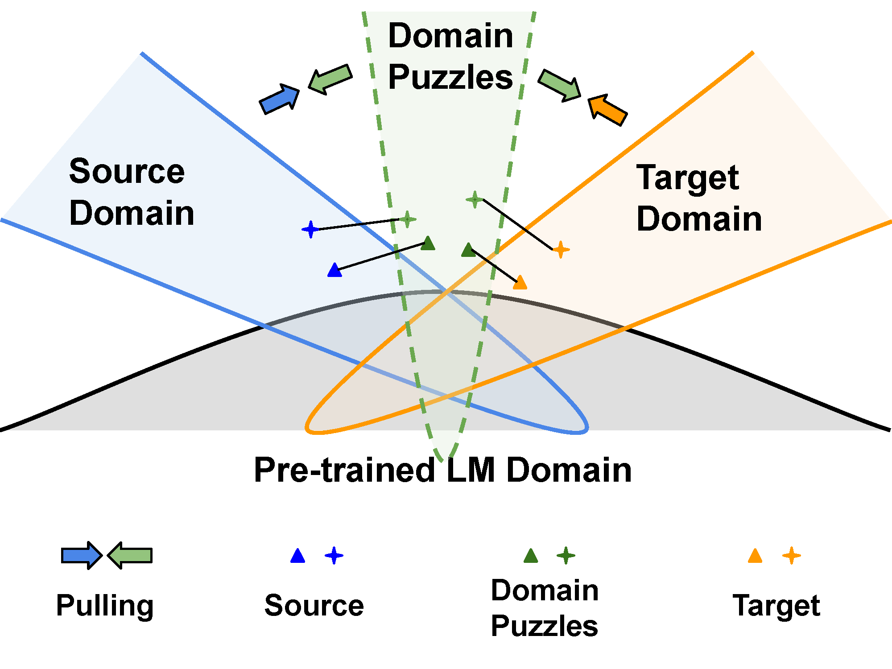
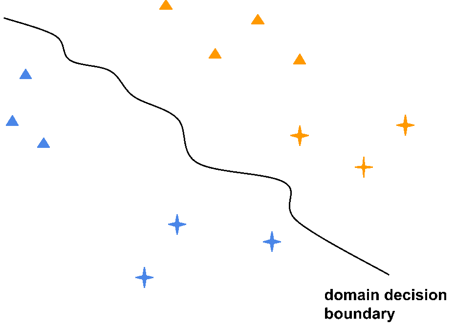

# Domain Confused Contrastive Learning (DCCL)

We propose the concept of domain puzzles which  discard domain-related information to confuse the model, making it difficult to differentiate which domain these puzzles belong to.

Motivation: Instead of directly seeking matched sentences across the source and target domains which is infeasible, we propose to pull the source (target) data and its corresponding domain puzzles closer to reduce the domain discrepancy.

You can view our NAACL 2022 paper [Domain Confused Contrastive Learning for Unsupervised Domain Adaptation](https://arxiv.org/abs/2207.04564).





## Dataset
- Amazon Benchmark 2-classes [Data](
https://www.cs.jhu.edu/~mdredze/datasets/sentiment/)
- Amazon Review 3-classes [Data](https://github.com/ruidan/DAS)

## Run

```bash
python train_contrast_freeLB.py 
       --batch_size 16 
       --sample_size 16 
       --adv_init_mag 5e-2 
       --adv_lr 5e-2 
       --adv_max_norm 0
       --norm_type l2
       --adv_alpha 1
       --contrast_lbd 0.03
       --tau 0.5 
       --contrast_update two 
       --domain_lbd 0.001 
       --consis_belta 0 
       --gpu 0
```

## Citing
Please cite the following paper if you found the resources in this repository useful.
```
@inproceedings{long-etal-2022-domain,
    title = "Domain Confused Contrastive Learning for Unsupervised Domain Adaptation",
    author = "Long, Quanyu  and
      Luo, Tianze  and
      Wang, Wenya  and
      Pan, Sinno",
    editor = "Carpuat, Marine  and
      de Marneffe, Marie-Catherine  and
      Meza Ruiz, Ivan Vladimir",
    booktitle = "Proceedings of the 2022 Conference of the North American Chapter of the Association for Computational Linguistics: Human Language Technologies",
    month = jul,
    year = "2022",
    address = "Seattle, United States",
    publisher = "Association for Computational Linguistics",
    url = "https://aclanthology.org/2022.naacl-main.217",
    doi = "10.18653/v1/2022.naacl-main.217",
    pages = "2982--2995"
}
```